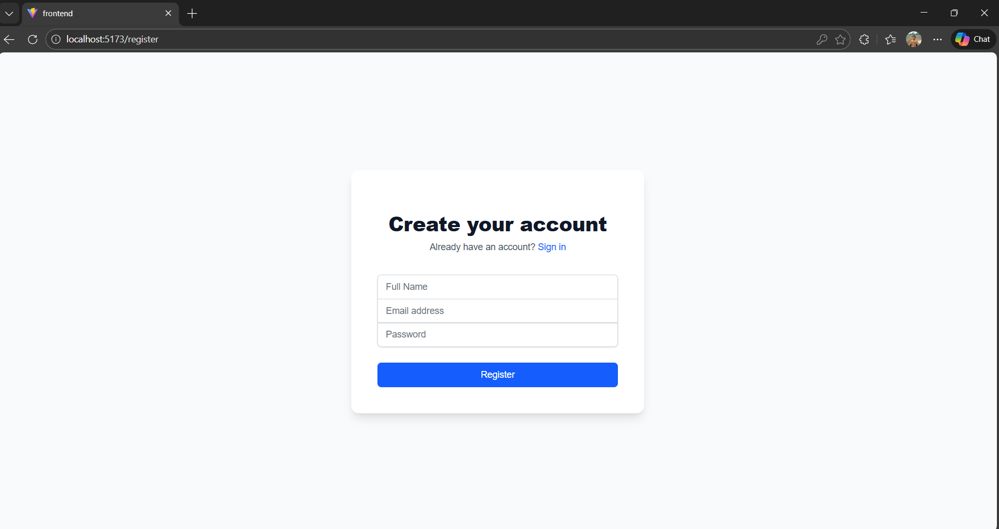

# Bug Tracker – Issue Tracking System

A full-stack Bug Tracker application inspired by tools like **Jira, Linear, and ClickUp**.  
This system allows teams to manage projects, track bugs, assign tasks, and monitor progress.

---

## Tech Stack

### Frontend
- React.js
- Tailwind CSS
- Axios
- React Router

### Backend
- FastAPI (Python)
- SQLAlchemy
- PostgreSQL
- JWT Authentication
- Pydantic

### Tools
- Docker & Docker Compose
- Swagger UI for API testing

---

## Features
- User registration and login with JWT authentication
- Project creation and management
- Ticket creation (bugs, tasks, features)
- Assign tickets to users
- Ticket status tracking
- RESTful API design
- Dockerized full-stack setup

---

## Project Structure

---

## How to Run the Project

### Prerequisites
- Docker
- Docker Compose

### Steps

1. Clone the repository:
git clone https://github.com/abhiramvsmg/Bug-tracker.git

cd Bug-tracker

2. Start all services:

3. Access the application:
- Frontend: http://localhost:5173
- Backend API: http://localhost:8000
- Swagger Docs: http://localhost:8000/docs

---

## API Endpoints (Sample)
- `POST /auth/register` – Register user
- `POST /auth/login` – Login user
- `GET /projects` – List projects
- `POST /tickets` – Create ticket

---
## 📸 Screenshots

### 🔐 Login Page

### 📊 Dashboard

### 🐞 Bug Creation

## Current Status
Prototype stage with:
- Authentication
- Project APIs
- Ticket APIs
- Frontend integration
- Dockerized environment

---

## Future Improvements
- Kanban board
- Comments on tickets
- Role-based access
- File uploads
- Cloud deployment

---

## Author
**Abhiram V**  
Computer Science Engineering Student  
2022–2026
